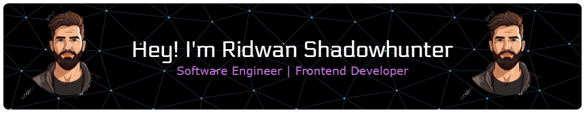

## Hi there 👋

<!--
**ridwan92shadowhunter/ridwan92shadowhunter** is a ✨ _special_ ✨ repository because its `README.md` (this file) appears on your GitHub profile.

Here are some ideas to get you started:

- 🔭 I’m currently working on ...
- 🌱 I’m currently learning ...
- 👯 I’m looking to collaborate on ...
- 🤔 I’m looking for help with ...
- 💬 Ask me about ...
- 📫 How to reach me: ...
- 😄 Pronouns: ...
- ⚡ Fun fact: ...
-->

# 💫 About Me:
🌱 I’m currently learning on **Web Programming Hack** 🌱 I’m currently learning React & Next JS

# 💻 Tech Stack:
             
# 📊 GitHub Stats:
 
 

## 🏆 GitHub Trophies

### 🔝 Top Contributed Repo

---

<!-- Proudly created with GPRM ( https://gprm.itsvg.in ) -->

<h3 align="center">A passionate frontend developer from Indonesia</h3>

<h3 align="left">Connect with me:</h3>

<h2 align="left">Play games with me</h2>

###

<picture>
  <source media="(prefers-color-scheme: dark)" srcset="https://raw.githubusercontent.com/ridwan92shadowhunter/ridwan92shadowhunter/output/pacman-contribution-graph-dark.svg">
  <source media="(prefers-color-scheme: light)" srcset="https://raw.githubusercontent.com/ridwan92shadowhunter/ridwan92shadowhunter/output/pacman-contribution-graph.svg">
  
</picture>

###

###
